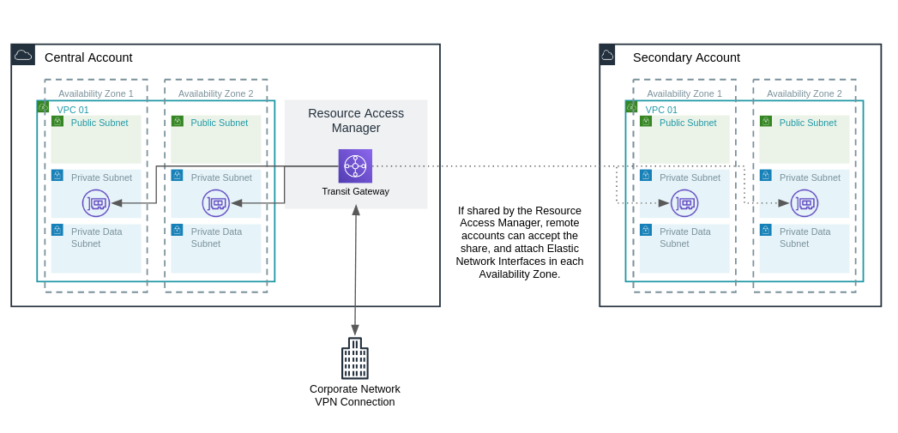

# Module - Transit Gateway

- [Module - Transit Gateway](#module---transit-gateway)
  - [Minimum Required Configuration](#minimum-required-configuration)
  - [Inputs and Outputs](#inputs-and-outputs)
    - [Inputs](#inputs)
    - [Outputs](#outputs)

This module creates an [AWS Transit Gateway](https://aws.amazon.com/transit-gateway/) (TGW) in the current account.  It can optionally share that TGW with other accounts.  The TGW can optionally be shared with other accounts via the [AWS Resource Access Manager](https://aws.amazon.com/ram/).  Accepting those shares is done manually in spoke accounts.  If multi-provider TGW sharing and accepting is a requirement, consider [this example](https://github.com/terraform-providers/terraform-provider-aws/tree/master/examples/transit-gateway-cross-account-vpc-attachment).



Transit Gateway attachments are not performed inside the module, but example attachments are included in the next section.

## Minimum Required Configuration

For a single Transit Gateway in the current account:

```terraform
module "tgw01" {
  source = "../relative/path/to/modules/transit-gateway"
  name   = "tgw01"
}

# One attachment per Availability Zone is required.  Select target subnets accordingly.
resource "aws_ec2_transit_gateway_vpc_attachment" "vpc01" {
  subnet_ids         = [ "subnet-XXXXXXXX", "subnet-YYYYYYYY" ]
  transit_gateway_id = module.tgw01.id
  vpc_id             = "vpc-XXXXXXXX"
}

```

For a Transit Gateway in the current account with additional sharing to sub-accounts:

```terraform
variable "aws_accounts" {
    description = "Map of Organization AWS accounts"
    type        = map
    default     = {
      central = {
        account_id = "111111111111"
        attribute1 = ""
      }
      development = {
        account_id = "222222222222"
        attribute1 = ""
      }
      production = {
        account_id = "333333333333"
        attribute1 = ""
      }
    }
}

# Target share accounts excludes "central" which owns the Transit Gateway
module "tgw01" {
  source                    = "../../modules/transit-gateway"
  allow_external_principals = true
  name                      = "tgw01"
  target_share_accounts     = [for k, v in var.aws_accounts : v["account_id"] if k != "central"]
}

resource "aws_ec2_transit_gateway_vpc_attachment" "vpc01" {
  subnet_ids         = [ "subnet-XXXXXXXX", "subnet-YYYYYYYY" ]
  transit_gateway_id = module.tgw01.id
  vpc_id             = "vpc-XXXXXXXX"
}
```

## Inputs and Outputs

Inputs and outputs are generated with [terraform-docs](https://github.com/segmentio/terraform-docs)

```bash
terraform-docs markdown table . | sed s/##/###/g
```

### Inputs

| Name | Description | Type | Default | Required |
|------|-------------|------|---------|:-----:|
| allow\_external\_principals | Allow principals outside your AWS Organization | `bool` | `false` | no |
| auto\_accept\_shared\_attachments | Auto accept shared attachments.  E.g. sub account VPC association | `string` | `"enable"` | no |
| name | Transit Gateway name.  Appended to related resources and tags | `string` | n/a | yes |
| tags | Tags to apply to all module resources | `map` | `{}` | no |
| target\_share\_accounts | List of AWS accounts to share the transit gateway with. | `list` | `[]` | no |

### Outputs

| Name | Description |
|------|-------------|
| id | Transit Gateway ID |
