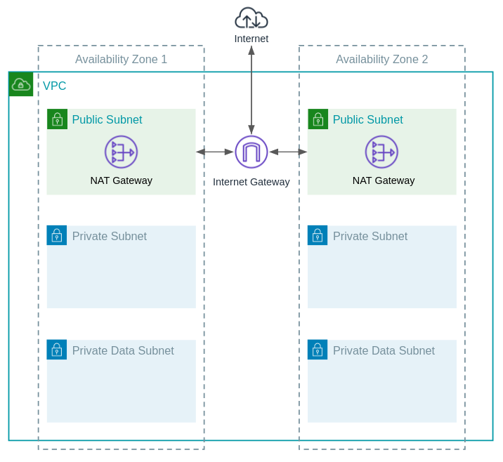

# Module - VPC

- [Module - VPC](#module---vpc)
  - [Routes](#routes)
  - [NACLs](#nacls)
  - [Minimum Required Configuration](#minimum-required-configuration)
  - [Inputs and Outputs](#inputs-and-outputs)
    - [Inputs](#inputs)
    - [Outputs](#outputs)

This module creates an IPv4 [AWS VPC](https://aws.amazon.com/vpc/faqs/) with a 3-tier architecture across a number of availability zones.   Each availability zone has it's own NAT gateway.

| Subnet Type | Default Route | Description |
|------|-------------|--------|
| Public | Internet Gateway (IGW) | Instances in this subnet have public IP addresses. |
| Private | NAT gateway | That NAT gateway resides in the public subnet. Instances in this subnet have only private addresses. |
| Data | None | Instances have private IP addresses and are only accessible from within the VPC or, if desired, over internal VPN address space.|



## Routes

In addition to the default routes outlined in the table above, it's important to note that each subnet has it's own route table.  This allows Availability Zone independence (E.g. private subnet routes to a NAT gateway in the same AZ) and subnet classification.

## NACLs

Because the Linux ephemeral port range encompasses the Windows port range, the Linux range is used by default on the private subnets.  The ephemeral port ranges allow both TCP **and** UDP to account for different NTP behavior by operating system.

Special cases exist where it may be required to open the ephemeral port range to `1024-65535`.  These include:

- AWS Lambda
- AWS EKS AMIs

For AWS specific ephemeral port ranges, see [this documentation](https://docs.aws.amazon.com/vpc/latest/userguide/vpc-network-acls.html#nacl-ephemeral-ports) for more details.

## Minimum Required Configuration

```terraform
module "vpc1" {
  source             = "../relative/path/to/modules/vpc"
  availability_zones = ["us-east-1a", "us-east-1b"]
  settings = {
    main = {
      name   = "vpc1"
      cidr   = "172.22.0.0/16"
      region = "us-east-1"
    }
    us-east-1a = {
      cidr_public     = "172.22.0.0/24"
      cidr_private    = "172.22.10.0/24"
      cidr_data       = "172.22.20.0/24"
      cidr_workspaces = "172.22.30.0/23" 
    }
    us-east-1b = {
      cidr_public  = "172.22.1.0/24"
      cidr_private = "172.22.11.0/24"
      cidr_data    = "172.22.21.0/24"
      cidr_workspaces = "172.22.32.0/23" 
    }
  }
  tags = {
    environment = "development"
    owner       = "user@domain.com"
    managed-by  = "terraform"
  }
}
```

## Inputs and Outputs

Inputs and outputs are generated with [terraform-docs](https://github.com/segmentio/terraform-docs)

```bash
terraform-docs markdown table ./
```

### Inputs

| Name | Description | Type | Default | Required |
|------|-------------|------|---------|:-----:|
| availability\_zones | List of subnet availability zones. | `list(string)` | n/a | yes |
| domain\_name | Domain name for DNS lookups inside associated VPCs. | `string` | `"ec2.internal"` | no |
| domain\_name\_servers | List of the DNS servers | `list(string)` | <code><pre>[<br>  "AmazonProvidedDNS"<br>]<br></pre></code> | no |
| expand\_ephemeral\_port\_range | TCP and UDP ephemeral range will be adjusted to 1024-65535 in private subnets.  Required for Lambda, EKS, etc.  https://docs.aws.amazon.com/vpc/latest/userguide/vpc-network-acls.html#nacl-ephemeral-ports | `bool` | `false` | no |
| flowlog\_retention | Flowlog retention in days for CloudWatch log group. | `number` | `7` | no |
| flowlog\_traffic\_type | Type of flowlog traffic to capture.  Valid values - ACCEPT, REJECT, ALL. | `string` | `"ALL"` | no |
| settings | Map of desired VPC settings.  Example in readme.md. | `map` | n/a | yes |
| single\_nat\_gateway | Single NAT Gateway for all AZs.  Provides cost savings in development environments. | `bool` | `false` | no |
| tags | Tags to apply to all VPC resources. | `map` | `{}` | no |

### Outputs

| Name | Description |
|------|-------------|
| cidr | VPC CIDR |
| data\_network\_acl | Data subnet NACLs |
| data\_route\_tables | Data subnet route tables |
| data\_subnet\_cidrs | Data subnet CIDRs |
| data\_subnet\_ids | Data subnet IDs |
| id | VPC ID |
| nat\_gateway\_ids | NAT Gateway IDs |
| nat\_gateway\_public\_ips | NAT Gateway IDs |
| private\_network\_acl | Private subnet NACLs |
| private\_route\_tables | Private subnet route tables |
| private\_subnet\_cidrs | Private subnet CIDRs |
| private\_subnet\_ids | Private subnet IDs |
| public\_network\_acl | Public subnet NACLs |
| public\_route\_tables | Public subnet route tables |
| public\_subnet\_cidrs | Public subnet CIDRs |
| public\_subnet\_ids | Public subnet IDs |
| workspaces\_network\_acl | Workspaces subnet NACLs |
| workspaces\_route\_tables | Workspaces subnet route tables |
| workspaces\_subnet\_cidrs | Workspaces subnet CIDRs |
| workspaces\_subnet\_ids | Workspaces subnet IDs |